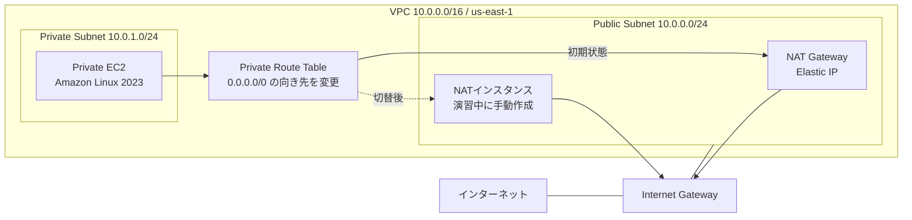

# NAT Gateway から NAT インスタンスへ切り替えるハンズオン

このハンズオンでは、最初に NAT Gateway を利用するVPCをAWS CDKで構築します。その後、EC2をNATインスタンスとして設定し、Private SubnetのデフォルトルートをNAT GatewayからNATインスタンスへ切り替えます。

切替前後でPrivate EC2からインターネットへアクセスし、送信元パブリックIPv4アドレスが変わることを確認します。

> [!WARNING]
> この構成は、NATの仕組みを学ぶための1 AZ・IPv4の最小構成です。単一のNATインスタンスは単一障害点になるため、そのまま本番環境へ適用しないでください。

## 到達目標

- Public SubnetとPrivate Subnetのルーティングを説明できる
- NAT Gateway経由でPrivate EC2がインターネットへ接続できることを確認できる
- Amazon Linux 2023をNATインスタンスとして設定できる
- Source/Destination Checkを無効にする理由を説明できる
- Private SubnetのデフォルトルートをNATインスタンスへ切り替えられる
- NAT GatewayとNATインスタンスの運用上の違いを説明できる

## 想定時間と前提条件

- 想定時間: 約3時間
- 利用リージョン: **米国東部（バージニア北部）`us-east-1`**
- AWSマネジメントコンソールとAWS CloudShellを利用できること
- CDKのBootstrap、CloudFormation、VPC、EC2、IAMを作成・削除できる権限があること
- ハンズオン用AWSアカウントの利用を推奨

CloudShell、Session Manager、AWSコンソールの表示言語によって、画面上の項目名が手順と多少異なる場合があります。

## 構成



初期状態では、Private EC2の外向き通信はNAT Gatewayを通ります。演習ではNAT Gateway自体を削除せず、Private Route Tableの`0.0.0.0/0`だけをNATインスタンスへ向けます。

## 料金の目安

以下は、**2026年7月31日時点**の`us-east-1`における公開価格を基に、すべての課金対象リソースが3時間存在したと仮定した概算です。無料利用枠やクレジットは適用せず、税、為替、通常のインターネットデータ転送料は含めていません。

| リソース | 仮単価 | 3時間の概算 |
|---|---:|---:|
| NAT Gateway 1台 | `$0.045/時間` | `$0.135` |
| パブリックIPv4 2個 | `$0.005/IP/時間` | `$0.030` |
| `t3.nano` EC2 2台 | `$0.0052/台/時間` | `$0.0312` |
| gp3 8 GiB × 2台 | `$0.08/GiB/月`の日割り | 約`$0.0053` |
| NAT Gatewayデータ処理 0.1 GB | `$0.045/GB` | `$0.0045` |
| Session Manager | EC2での利用は追加料金なし | `$0.000` |
| **合計目安** |  | **約`$0.21`** |

計算式は次のとおりです。

```text
NAT Gateway       : $0.045 × 3時間                    = $0.135
パブリックIPv4     : $0.005 × 2個 × 3時間              = $0.030
EC2               : $0.0052 × 2台 × 3時間             = $0.0312
gp3               : $0.08 × 16 GiB × 3時間 ÷ 730時間  ≒ $0.0053
NATデータ処理      : $0.045 × 0.1 GB                  = $0.0045
合計                                                   ≒ $0.206（約$0.21）
```

パブリックIPv4は、NAT GatewayのElastic IPとNATインスタンスの自動割り当てIPv4の2個です。データ処理量は疎通確認とパッケージ導入を含めて0.1 GBと仮定しています。

実際の料金は、通信量、リソースの存在時間、無料利用枠、アカウント条件、価格改定により異なります。通常は数十円程度ですが、**後片付けを忘れると課金が継続します**。開始前に最新価格も確認してください。

- [Amazon VPC料金](https://aws.amazon.com/vpc/pricing/)
- [Amazon EC2オンデマンド料金](https://aws.amazon.com/ec2/pricing/on-demand/)
- [Amazon EBS料金](https://aws.amazon.com/ebs/pricing/)
- [AWS Systems Manager料金](https://aws.amazon.com/systems-manager/pricing/)

## 1. CloudShellを準備する

AWSマネジメントコンソールでリージョンを**米国東部（バージニア北部）`us-east-1`**へ変更し、CloudShellを開きます。

### 1.1 Node.js 24をインストールする

CloudShellで次のコマンドを実行します。

```bash
# nvmのインストール
curl -o- https://raw.githubusercontent.com/nvm-sh/nvm/v0.40.6/install.sh | bash
source ~/.bashrc

# Node.js 24のインストール
nvm install 24
nvm use 24
node -v  # v24.x.x と表示されることを確認
```

### 1.2 リージョンとアカウントを確認する

```bash
aws configure set region us-east-1
aws configure get region
aws sts get-caller-identity
```

`aws configure get region`が`us-east-1`を表示することを確認します。

### 1.3 プロジェクトを配置する

配布されたプロジェクトをCloudShellへアップロードするか、指定されたGitリポジトリをCloneし、プロジェクトディレクトリへ移動します。

```bash
cd nat-gateway-to-nat-instance-handson
npm install
```

## 2. 初期環境をデプロイする

アカウントIDを取得し、`us-east-1`を明示してBootstrapします。Bootstrapは、同じアカウント・リージョンで初めてCDKを利用するときだけ必要です。再実行しても問題ありません。

```bash
export CDK_DEFAULT_ACCOUNT=$(aws sts get-caller-identity --query Account --output text)
npx cdk bootstrap aws://${CDK_DEFAULT_ACCOUNT}/us-east-1
npx cdk deploy --require-approval never
```

確認を求められた場合は、変更内容を確認してデプロイを続行します。完了すると、次のようなOutputsが表示されます。

| Output | 用途 |
|---|---|
| `VpcId` | NATインスタンスを作成するVPC |
| `PublicSubnetId` | NATインスタンスを配置するサブネット |
| `PrivateSubnetId` | Private EC2を配置したサブネット |
| `PrivateInstanceId` | Session Managerで接続するPrivate EC2 |
| `NatGatewayPublicIp` | 切替前の送信元パブリックIPv4 |
| `SessionManagerInstanceProfileName` | NATインスタンスへ設定するIAMインスタンスプロファイル |

Outputsを後から確認する場合は、次のコマンドを実行します。

```bash
aws cloudformation describe-stacks \
  --stack-name NatGatewayToNatInstanceHandsonStack \
  --region us-east-1 \
  --query 'Stacks[0].Outputs[*].[OutputKey,OutputValue]' \
  --output table
```

## 3. NAT Gateway経由の通信を確認する

1. EC2コンソールを開きます。
2. 左側メニューから **インスタンス** を選択します。
3. `nat-handson-private-ec2`を選択します。
4. **接続**、**セッションマネージャー**、**接続**の順に選択します。
5. セッション内で次のコマンドを実行します。

```bash
curl --fail --silent --show-error https://checkip.amazonaws.com
```

表示されたIPv4アドレスを記録します。CloudFormation Outputの`NatGatewayPublicIp`と一致すれば、Private EC2がNAT Gateway経由でインターネットへ接続できています。

接続できない場合、デプロイ直後でSSM Agentの登録が完了していない可能性があります。数分待ってから再試行してください。

## 4. NATインスタンスを作成する

### 4.1 セキュリティグループを作成する

1. EC2コンソールの左側メニューから **セキュリティグループ** を開きます。
2. **セキュリティグループを作成** を選択します。
3. セキュリティグループ名に`nat-handson-nat-instance-sg`を入力します。
4. VPCにはOutputの`VpcId`に対応するVPCを選択します。
5. インバウンドルールを次の2件だけ設定します。

| タイプ | プロトコル | ポート | ソース |
|---|---|---:|---|
| HTTP | TCP | 80 | `10.0.1.0/24` |
| HTTPS | TCP | 443 | `10.0.1.0/24` |

6. アウトバウンドルールで、すべてのIPv4トラフィックが`0.0.0.0/0`へ許可されていることを確認します。
7. **セキュリティグループを作成** を選択します。

SSHのインバウンドルールは追加しません。NATインスタンスへの接続にはSession Managerを使用します。

### 4.2 EC2を起動する

EC2コンソールで **インスタンスを起動** を選択し、次のように設定します。

| 項目 | 設定値 |
|---|---|
| 名前 | `nat-handson-nat-instance` |
| AMI | Amazon Linux 2023 AMI（x86_64） |
| インスタンスタイプ | `t3.nano` |
| キーペア | **キーペアなしで続行** |
| VPC | Outputの`VpcId`に対応するVPC |
| サブネット | Outputの`PublicSubnetId` |
| パブリックIPの自動割り当て | **有効化** |
| ファイアウォール | **既存のセキュリティグループを選択する** |
| セキュリティグループ | 4.1で作成した`nat-handson-nat-instance-sg` |
| ルートボリューム | gp3、8 GiB、暗号化有効 |

**高度な詳細**を開き、**IAMインスタンスプロファイル**でOutputの`SessionManagerInstanceProfileName`に対応するプロファイルを選択します。

設定を確認してインスタンスを起動します。インスタンスが`実行中`になり、ステータスチェックが成功するまで待ちます。

> [!NOTE]
> NATインスタンス自身がインターネットへ出るには、Public Subnet、Internet Gatewayへのルート、パブリックIPv4が必要です。このハンズオンではElastic IPではなく、自動割り当てのパブリックIPv4を利用します。

## 5. LinuxをNATとして設定する

作成した`nat-handson-nat-instance`を選択し、Session Managerで接続します。

### 5.1 iptablesを有効化する

```bash
sudo yum install iptables-services -y
sudo systemctl enable iptables
sudo systemctl start iptables
```

### 5.2 IP forwardingを有効化する

```bash
echo 'net.ipv4.ip_forward=1' | sudo tee /etc/sysctl.d/custom-ip-forwarding.conf
sudo sysctl -p /etc/sysctl.d/custom-ip-forwarding.conf
```

次の結果が表示されることを確認します。

```text
net.ipv4.ip_forward = 1
```

### 5.3 NATを設定する

プライマリネットワークインターフェイス名を確認します。Amazon Linux 2023では`ens5`や`enX0`などになる場合があります。

```bash
PRIMARY_INTERFACE=$(ip route show default | awk '/default/ {print $5; exit}')
echo "${PRIMARY_INTERFACE}"
```

空欄ではないことを確認してから、NATと転送を設定して保存します。

```bash
sudo /sbin/iptables -t nat -A POSTROUTING -o "${PRIMARY_INTERFACE}" -j MASQUERADE
sudo /sbin/iptables -F FORWARD
sudo /sbin/iptables -P FORWARD ACCEPT
sudo service iptables save
```

設定を確認します。

```bash
sudo /sbin/iptables -t nat -L POSTROUTING -n -v
sudo /sbin/iptables -L FORWARD -n -v
```

`POSTROUTING`に`MASQUERADE`があり、`FORWARD`のpolicyが`ACCEPT`であることを確認します。

## 6. Source/Destination Checkを無効化する

EC2インスタンスは、通常、自分自身が送信元または宛先ではないパケットを破棄します。NATインスタンスはPrivate EC2の代理でパケットを転送するため、このチェックを無効にする必要があります。

1. EC2コンソールで`nat-handson-nat-instance`を選択します。
2. **アクション**、**ネットワーキング**、**送信元/送信先チェックを変更**を選択します。
3. Source/Destination Checkを停止または無効にします。
4. 変更を保存します。

## 7. Private Subnetのルートを切り替える

1. VPCコンソールで **お使いのVPC** を開き、Outputの`VpcId`に対応する`nat-handson-vpc`を選択します。
2. **リソースマップ**を開き、Private Subnet（名前に`Private`を含むサブネット）に接続されているルートテーブルを選択します。Outputの`PrivateSubnetId`でも対象サブネットを確認できます。
3. 遷移したルートテーブルの **ルート**タブで **ルートを編集** を選択します。
4. NAT Gatewayをターゲットとする`0.0.0.0/0`のルートを削除します。
5. 次のルートを追加します。

| 送信先 | ターゲットの種類 | ターゲット |
|---|---|---|
| `0.0.0.0/0` | インスタンス | `nat-handson-nat-instance` |

6. 変更を保存します。

NAT Gatewayは削除されていませんが、Private Subnetの外向き通信経路としては使われなくなります。

## 8. NATインスタンス経由の通信を確認する

切替前に開いていたPrivate EC2のセッションを終了し、EC2コンソールから`nat-handson-private-ec2`へSession Managerで再接続します。再接続できること自体も、HTTPS通信がNATインスタンスを通過できていることの確認になります。

```bash
curl --fail --silent --show-error https://checkip.amazonaws.com
```

次の2点を確認します。

- コマンドが成功し、IPv4アドレスが表示される
- 表示されたIPがNAT GatewayのElastic IPではなく、NATインスタンスのパブリックIPv4と一致する

NATインスタンスのパブリックIPv4は、EC2コンソールのインスタンス詳細で確認できます。

## トラブルシューティング

### NATインスタンスへSession Managerで接続できない

- NATインスタンスがPublic Subnet `10.0.0.0/24`にあるか
- パブリックIPv4が割り当てられているか
- Public Route Tableに`0.0.0.0/0 → Internet Gateway`があるか
- CDKが作成したIAMインスタンスプロファイルを設定したか
- アウトバウンドHTTPSが許可されているか
- 起動後数分待ってもSession Managerの対象に表示されないか

### Private EC2へ再接続できない、または`curl`が失敗する

以下を上から順番に確認します。

1. Private Route Tableの`0.0.0.0/0`が正しいNATインスタンスを指している
2. NATインスタンスが実行中で、パブリックIPv4を持っている
3. NATインスタンスのSource/Destination Checkが無効
4. NAT用セキュリティグループが`10.0.1.0/24`からのHTTPSを許可
5. IP forwardingが有効

```bash
sysctl net.ipv4.ip_forward
```

6. `MASQUERADE`ルールとFORWARD policyが存在

```bash
sudo /sbin/iptables -t nat -L POSTROUTING -n -v
sudo /sbin/iptables -L FORWARD -n -v
```

7. NATインスタンス自身から外部へ接続可能

```bash
curl --fail --silent --show-error https://checkip.amazonaws.com
```

切り分けが必要な場合は、Private Route Tableの`0.0.0.0/0`を元のNAT Gatewayへ戻すと、初期状態へ復旧できます。

## NAT GatewayとNATインスタンスの比較

| 観点 | NAT Gateway | NATインスタンス |
|---|---|---|
| 管理 | AWSによるマネージドサービス | OS、iptables、パッチを利用者が管理 |
| 可用性 | AZ内で冗長化されたサービス | 単一構成では単一障害点 |
| 帯域 | 自動的にスケール | インスタンスタイプとネットワーク性能に依存 |
| 障害復旧 | サービス側で管理 | 検知、交換、ルート変更を設計する必要あり |
| セキュリティグループ | NAT Gateway自体には設定しない | EC2のセキュリティグループを設定 |
| 料金 | 時間料金とデータ処理料金 | EC2、EBS、パブリックIPv4等 |
| 柔軟性 | NAT用途に特化 | OS上でフィルタや追加処理が可能 |

## Elastic IPは必要か

NATインスタンスのNAT機能そのものにElastic IPは必須ではありません。Public Subnetにあり、Internet GatewayへのルートとパブリックIPv4があれば、Private EC2の通信を中継できます。Private Route TableもIPアドレスではなくNATインスタンスをターゲットにします。

ただし、自動割り当てのパブリックIPv4はインスタンスを停止・起動すると変わります。次の要件がある場合はElastic IPを検討します。

- 接続先で送信元IPを許可リストへ登録する
- 外部へ通知する送信元IPを固定する
- 停止・起動後も同じIPを維持する
- 障害時に代替インスタンスへIPを付け替える

Elastic IPを付けるだけではNATインスタンスの可用性は確保されません。実運用では監視、代替インスタンスの起動、Elastic IPの付け替え、ルート変更、複数AZ化なども設計する必要があります。

## 後片付け

> [!CAUTION]
> 課金を止めるため、ハンズオン終了後は必ず後片付けを実施してください。

### 1. NATインスタンスを終了する

1. EC2コンソールで`nat-handson-nat-instance`を選択します。
2. **インスタンスの状態**、**インスタンスを終了**を選択します。
3. 状態が`終了済み`になるまで待ちます。

NATインスタンスのルートボリュームは、起動時の既定どおり「終了時に削除」が有効であることを前提とします。

### 2. NAT用セキュリティグループを削除する

EC2またはVPCコンソールで`nat-handson-nat-instance-sg`を削除します。ネットワークインターフェイスの削除処理中は失敗する場合があるため、少し待ってから再試行してください。

### 3. CDKスタックを削除する

CloudShellのプロジェクトディレクトリで実行します。

```bash
nvm use 24
export CDK_DEFAULT_ACCOUNT=$(aws sts get-caller-identity --query Account --output text)
npx cdk destroy --force
```

### 4. 削除結果を確認する

`us-east-1`で次が残っていないことを確認します。

- CloudFormationスタック`NatGatewayToNatInstanceHandsonStack`
- `nat-handson-`で始まるEC2、VPC、サブネット、ルートテーブル、NAT Gateway
- ハンズオンで作成されたElastic IP
- `nat-handson-nat-instance-sg`

## 参考資料

- [NATインスタンスを使用する（Amazon VPC User Guide）](https://docs.aws.amazon.com/vpc/latest/userguide/work-with-nat-instances.html)
- [NATデバイスへのルーティング](https://docs.aws.amazon.com/vpc/latest/userguide/route-table-options.html#route-tables-nat)
- [AWS Systems Manager Session Manager](https://docs.aws.amazon.com/systems-manager/latest/userguide/session-manager.html)
- [AWS CDK v2 Developer Guide](https://docs.aws.amazon.com/cdk/v2/guide/home.html)
