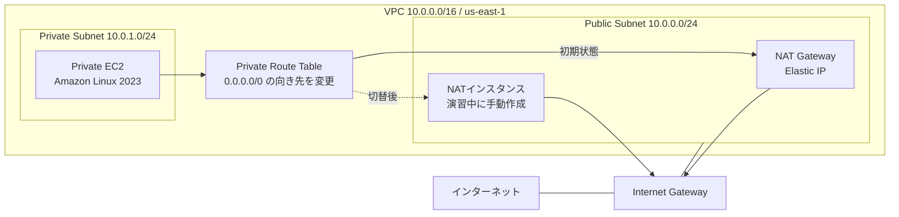

# NAT Gateway から NAT インスタンスへ切り替えるハンズオン

このハンズオンでは、最初に NAT Gateway を利用するVPCをAWS CDKで構築します。その後、EC2をNATインスタンスとして設定し、Private SubnetのデフォルトルートをNAT GatewayからNATインスタンスへ切り替えます。

切替前後でPrivate EC2からインターネットへアクセスし、送信元パブリックIPv4アドレスが変わることを確認します。

> [!WARNING]
> この構成は、NATの仕組みを学ぶための1 AZ・IPv4の最小構成です。単一のNATインスタンスは単一障害点になるため、そのまま本番環境へ適用しないでください。

## 到達目標

- Public SubnetとPrivate Subnetのルーティングを説明できる
- NAT Gateway経由でPrivate EC2がインターネットへ接続できることを確認できる
- Amazon Linux 2023をNATインスタンスとして設定できる
- Source/Destination Checkを無効にする理由を説明できる
- Private SubnetのデフォルトルートをNATインスタンスへ切り替えられる
- NAT GatewayとNATインスタンスの運用上の違いを説明できる

## 想定時間と前提条件

- 想定時間: 約3時間
- 利用リージョン: **米国東部（バージニア北部）`us-east-1`**
- AWSマネジメントコンソールとAWS CloudShellを利用できること
- CDKのBootstrap、CloudFormation、VPC、EC2、IAMを作成・削除できる権限があること
- ハンズオン用AWSアカウントの利用を推奨

CloudShell、Session Manager、AWSコンソールの表示言語によって、画面上の項目名が手順と多少異なる場合があります。

## 構成



初期状態では、Private EC2の外向き通信はNAT Gatewayを通ります。演習ではNAT Gateway自体を削除せず、Private Route Tableの`0.0.0.0/0`だけをNATインスタンスへ向けます。

## 料金の目安

以下は、**2026年7月31日時点**の`us-east-1`における公開価格を基に、すべての課金対象リソースが3時間存在したと仮定した概算です。無料利用枠やクレジットは適用せず、税、為替、通常のインターネットデータ転送料は含めていません。

| リソース | 仮単価 | 3時間の概算 |
|---|---:|---:|
| NAT Gateway 1台 | `$0.045/時間` | `$0.135` |
| パブリックIPv4 2個 | `$0.005/IP/時間` | `$0.030` |
| `t3.nano` EC2 2台 | `$0.0052/台/時間` | `$0.0312` |
| gp3 8 GiB × 2台 | `$0.08/GiB/月`の日割り | 約`$0.0053` |
| NAT Gatewayデータ処理 0.1 GB | `$0.045/GB` | `$0.0045` |
| Session Manager | EC2での利用は追加料金なし | `$0.000` |
| **合計目安** |  | **約`$0.21`** |

計算式は次のとおりです。

```text
NAT Gateway       : $0.045 × 3時間                    = $0.135
パブリックIPv4     : $0.005 × 2個 × 3時間              = $0.030
EC2               : $0.0052 × 2台 × 3時間             = $0.0312
gp3               : $0.08 × 16 GiB × 3時間 ÷ 730時間  ≒ $0.0053
NATデータ処理      : $0.045 × 0.1 GB                  = $0.0045
合計                                                   ≒ $0.206（約$0.21）
```

パブリックIPv4は、NAT GatewayのElastic IPとNATインスタンスの自動割り当てIPv4の2個です。データ処理量は疎通確認とパッケージ導入を含めて0.1 GBと仮定しています。

実際の料金は、通信量、リソースの存在時間、無料利用枠、アカウント条件、価格改定により異なります。通常は数十円程度ですが、**後片付けを忘れると課金が継続します**。開始前に最新価格も確認してください。

- [Amazon VPC料金](https://aws.amazon.com/vpc/pricing/)
- [Amazon EC2オンデマンド料金](https://aws.amazon.com/ec2/pricing/on-demand/)
- [Amazon EBS料金](https://aws.amazon.com/ebs/pricing/)
- [AWS Systems Manager料金](https://aws.amazon.com/systems-manager/pricing/)

## 1. CloudShellを準備する

AWSマネジメントコンソールでリージョンを**米国東部（バージニア北部）`us-east-1`**へ変更し、CloudShellを開きます。

### 1.1 Node.js 22をインストールする

CloudShellで次のコマンドを実行します。

```bash
# nvmのインストール
curl -o- https://raw.githubusercontent.com/nvm-sh/nvm/v0.40.6/install.sh | bash
source ~/.bashrc

# Node.js 22のインストール
nvm install 22
nvm use 22
node -v  # v22.15.0 以上と表示されることを確認
npm -v   # 10.5.0 以上と表示されることを確認
```

> [!IMPORTANT]
> このプロジェクトが利用する`aws-cdk-lib`は、推移的依存として`@aws/cloudformation-validate@1.5.0-beta`を含みます。このバージョンはNode.jsを`^22.15.0`、npmを`>=10.5.0`に制限しており、`.npmrc`の`engine-strict=true`によってNode.js 24では`EBADENGINE`になります。そのため、依存パッケージ側の対応範囲が変更されるまではNode.js 22を使用します。

### 1.2 リージョンとアカウントを確認する

```bash
aws configure set region us-east-1
aws configure get region
aws sts get-caller-identity
```

`aws configure get region`が`us-east-1`を表示することを確認します。

### 1.3 プロジェクトを配置する

GitHubからプロジェクトをCloneし、プロジェクトディレクトリへ移動します。

```bash
git clone https://github.com/haw/nat-gateway-to-nat-instance-handson.git
cd nat-gateway-to-nat-instance-handson
npm ci
```

## 2. 初期環境をデプロイする

アカウントIDを取得し、`us-east-1`を明示してBootstrapします。Bootstrapは、同じアカウント・リージョンで初めてCDKを利用するときだけ必要です。再実行しても問題ありません。

```bash
export CDK_DEFAULT_ACCOUNT=$(aws sts get-caller-identity --query Account --output text)
npx cdk bootstrap aws://${CDK_DEFAULT_ACCOUNT}/us-east-1
npx cdk deploy --require-approval never
```

確認を求められた場合は、変更内容を確認してデプロイを続行します。完了すると、次のようなOutputsが表示されます。

| Output | 用途 |
|---|---|
| `VpcId` | NATインスタンスを作成するVPC |
| `PublicSubnetId` | NATインスタンスを配置するサブネット |
| `PrivateSubnetId` | Private EC2を配置したサブネット |
| `PrivateInstanceId` | Session Managerで接続するPrivate EC2 |
| `NatGatewayPublicIp` | 切替前の送信元パブリックIPv4 |
| `SessionManagerInstanceProfileName` | NATインスタンスへ設定するIAMインスタンスプロファイル |

Outputsを後から確認する場合は、次のコマンドを実行します。

```bash
aws cloudformation describe-stacks \
  --stack-name NatGatewayToNatInstanceHandsonStack \
  --region us-east-1 \
  --query 'Stacks[0].Outputs[*].[OutputKey,OutputValue]' \
  --output table
```

## 3. NAT Gateway経由の通信を確認する

1. EC2コンソールを開きます。
2. 左側メニューから **インスタンス** を選択します。
3. `nat-handson-private-ec2`を選択します。
4. **接続**、**セッションマネージャー**、**接続**の順に選択します。
5. セッション内で次のコマンドを実行します。

```bash
curl --fail --silent --show-error https://checkip.amazonaws.com
```

表示されたIPv4アドレスを記録します。CloudFormation Outputの`NatGatewayPublicIp`と一致すれば、Private EC2がNAT Gateway経由でインターネットへ接続できています。

接続できない場合、デプロイ直後でSSM Agentの登録が完了していない可能性があります。数分待ってから再試行してください。

## 4. NATインスタンスを作成する

### 4.1 セキュリティグループを作成する

1. EC2コンソールの左側メニューから **セキュリティグループ** を開きます。
2. **セキュリティグループを作成** を選択します。
3. セキュリティグループ名に`nat-handson-nat-instance-sg`を入力します。
4. VPCにはOutputの`VpcId`に対応するVPCを選択します。
5. 本ハンズオンでは、インバウンドルールを次の2件だけ設定します。

| タイプ | プロトコル | ポート | ソース |
|---|---|---:|---|
| HTTP | TCP | 80 | `10.0.1.0/24` |
| HTTPS | TCP | 443 | `10.0.1.0/24` |

> [!NOTE]
> ソースの`10.0.1.0/24`は、NATインスタンスを経由して外向き通信を許可するPrivate SubnetのCIDRです。HTTP/HTTPSは今回の確認で中継する通信の例であり、実際の構成では必要なプロトコルとポートだけを許可します。

6. アウトバウンドルールで、すべてのIPv4トラフィックが`0.0.0.0/0`へ許可されていることを確認します。
7. **セキュリティグループを作成** を選択します。

SSHのインバウンドルールは追加しません。NATインスタンスへの接続にはSession Managerを使用します。

### 4.2 EC2を起動する

EC2コンソールで **インスタンスを起動** を選択し、次のように設定します。

| 項目 | 設定値 |
|---|---|
| 名前 | `nat-handson-nat-instance` |
| AMI | Amazon Linux 2023 AMI（x86_64） |
| インスタンスタイプ | `t3.nano` |
| キーペア | **キーペアなしで続行** |
| VPC | Outputの`VpcId`に対応するVPC |
| サブネット | Outputの`PublicSubnetId` |
| パブリックIPの自動割り当て | **有効化** |
| ファイアウォール | **既存のセキュリティグループを選択する** |
| セキュリティグループ | 4.1で作成した`nat-handson-nat-instance-sg` |
| ルートボリューム | gp3、8 GiB、暗号化有効 |

**高度な詳細**を開き、**IAMインスタンスプロファイル**の検索欄に`NatGatewayToNatInstanceHandsonStack`を入力します。表示された候補から、Outputの`SessionManagerInstanceProfileName`と一致するプロファイルを選択します。

> [!NOTE]
> このインスタンスプロファイルには、AWS管理ポリシー`AmazonSSMManagedInstanceCore`を付与したIAMロールが含まれています。これにより、NATインスタンスをSystems Managerのマネージドノードとして登録し、SSHポートやキーペアを使わずにSession Managerから接続できます。

設定を確認してインスタンスを起動します。インスタンスが`実行中`になり、ステータスチェックが成功するまで待ちます。

> [!NOTE]
> NATインスタンス自身がインターネットへ出るには、Public Subnet、Internet Gatewayへのルート、パブリックIPv4が必要です。このハンズオンではElastic IPではなく、自動割り当てのパブリックIPv4を利用します。

## 5. LinuxをNATとして設定する

作成した`nat-handson-nat-instance`を選択し、Session Managerで接続します。

### 5.1 iptablesを有効化する

最初に、Session Managerの接続ユーザーから`ec2-user`へ切り替えます。

```bash
sudo su - ec2-user
whoami
```

`ec2-user`と表示されることを確認します。以降の手順は、この`ec2-user`のシェルで実行します。

```bash
sudo yum install iptables-services -y
sudo systemctl enable iptables
sudo systemctl start iptables
```

### 5.2 IP forwardingを有効化する

```bash
echo 'net.ipv4.ip_forward=1' | sudo tee /etc/sysctl.d/custom-ip-forwarding.conf
sudo sysctl -p /etc/sysctl.d/custom-ip-forwarding.conf
```

次の結果が表示されることを確認します。

```text
net.ipv4.ip_forward = 1
```

### 5.3 NATを設定する

プライマリネットワークインターフェイス名を確認します。Amazon Linux 2023では`ens5`や`enX0`などになる場合があります。

```bash
PRIMARY_INTERFACE=$(ip route show default | awk '/default/ {print $5; exit}')
echo "${PRIMARY_INTERFACE}"
```

空欄ではないことを確認してから、NATと転送を設定して保存します。

```bash
sudo /sbin/iptables -t nat -A POSTROUTING -o "${PRIMARY_INTERFACE}" -j MASQUERADE
sudo /sbin/iptables -F FORWARD
sudo /sbin/iptables -P FORWARD ACCEPT
sudo service iptables save
```

設定を確認します。

```bash
sudo /sbin/iptables -t nat -L POSTROUTING -n -v
sudo /sbin/iptables -L FORWARD -n -v
```

`POSTROUTING`に`MASQUERADE`があり、`FORWARD`のpolicyが`ACCEPT`であることを確認します。

## 6. Source/Destination Checkを無効化する

EC2インスタンスは、通常、自分自身が送信元または宛先ではないパケットを破棄します。NATインスタンスはPrivate EC2の代理でパケットを転送するため、このチェックを無効にする必要があります。

1. EC2コンソールで`nat-handson-nat-instance`を選択します。
2. **アクション**、**ネットワーキング**、**送信元/送信先チェックを変更**を選択します。
3. Source/Destination Checkを停止または無効にします。
4. 変更を保存します。

## 7. Private Subnetのルートを切り替える

1. VPCコンソールで **お使いのVPC** を開き、Outputの`VpcId`に対応する`nat-handson-vpc`を選択します。
2. **リソースマップ**を開き、Private Subnet（名前に`Private`を含むサブネット）に接続されているルートテーブルを選択します。Outputの`PrivateSubnetId`でも対象サブネットを確認できます。
3. 遷移したルートテーブルの **ルート**タブで **ルートを編集** を選択します。
4. NAT Gatewayをターゲットとする`0.0.0.0/0`のルートを削除します。
5. 次のルートを追加します。

| 送信先 | ターゲットの種類 | ターゲット |
|---|---|---|
| `0.0.0.0/0` | インスタンス | `nat-handson-nat-instance` |

6. 変更を保存します。

NAT Gatewayは削除されていませんが、Private Subnetの外向き通信経路としては使われなくなります。

## 8. NATインスタンス経由の通信を確認する

切替前に開いていたPrivate EC2のセッションを終了し、EC2コンソールから`nat-handson-private-ec2`へSession Managerで再接続します。再接続できること自体も、HTTPS通信がNATインスタンスを通過できていることの確認になります。

```bash
curl --fail --silent --show-error https://checkip.amazonaws.com
```

次の2点を確認します。

- コマンドが成功し、IPv4アドレスが表示される
- 表示されたIPがNAT GatewayのElastic IPではなく、NATインスタンスのパブリックIPv4と一致する

NATインスタンスのパブリックIPv4は、EC2コンソールのインスタンス詳細で確認できます。

## トラブルシューティング

### NATインスタンスへSession Managerで接続できない

- NATインスタンスがPublic Subnet `10.0.0.0/24`にあるか
- パブリックIPv4が割り当てられているか
- Public Route Tableに`0.0.0.0/0 → Internet Gateway`があるか
- CDKが作成したIAMインスタンスプロファイルを設定したか
- アウトバウンドHTTPSが許可されているか
- 起動後数分待ってもSession Managerの対象に表示されないか

### Private EC2へ再接続できない、または`curl`が失敗する

以下を上から順番に確認します。

1. Private Route Tableの`0.0.0.0/0`が正しいNATインスタンスを指している
2. NATインスタンスが実行中で、パブリックIPv4を持っている
3. NATインスタンスのSource/Destination Checkが無効
4. NAT用セキュリティグループが`10.0.1.0/24`からのHTTPSを許可
5. IP forwardingが有効

```bash
sysctl net.ipv4.ip_forward
```

6. `MASQUERADE`ルールとFORWARD policyが存在

```bash
sudo /sbin/iptables -t nat -L POSTROUTING -n -v
sudo /sbin/iptables -L FORWARD -n -v
```

7. NATインスタンス自身から外部へ接続可能

```bash
curl --fail --silent --show-error https://checkip.amazonaws.com
```

切り分けが必要な場合は、Private Route Tableの`0.0.0.0/0`を元のNAT Gatewayへ戻すと、初期状態へ復旧できます。

## NAT GatewayとNATインスタンスの比較

| 観点 | NAT Gateway | NATインスタンス |
|---|---|---|
| 管理 | AWSによるマネージドサービス | OS、iptables、パッチを利用者が管理 |
| 可用性 | AZ内で冗長化されたサービス | 単一構成では単一障害点 |
| 帯域 | 自動的にスケール | インスタンスタイプとネットワーク性能に依存 |
| 障害復旧 | サービス側で管理 | 検知、交換、ルート変更を設計する必要あり |
| セキュリティグループ | NAT Gateway自体には設定しない | EC2のセキュリティグループを設定 |
| 料金 | 時間料金とデータ処理料金 | EC2、EBS、パブリックIPv4等 |
| 柔軟性 | NAT用途に特化 | OS上でフィルタや追加処理が可能 |

## Elastic IPは必要か

NATインスタンスのNAT機能そのものにElastic IPは必須ではありません。Public Subnetにあり、Internet GatewayへのルートとパブリックIPv4があれば、Private EC2の通信を中継できます。Private Route TableもIPアドレスではなくNATインスタンスをターゲットにします。

ただし、自動割り当てのパブリックIPv4はインスタンスを停止・起動すると変わります。次の要件がある場合はElastic IPを検討します。

- 接続先で送信元IPを許可リストへ登録する
- 外部へ通知する送信元IPを固定する
- 停止・起動後も同じIPを維持する
- 障害時に代替インスタンスへIPを付け替える

Elastic IPを付けるだけではNATインスタンスの可用性は確保されません。実運用では監視、代替インスタンスの起動、Elastic IPの付け替え、ルート変更、複数AZ化なども設計する必要があります。

## 後片付け

> [!CAUTION]
> 課金を止めるため、ハンズオン終了後は必ず後片付けを実施してください。

### 1. NATインスタンスを終了する

1. EC2コンソールで`nat-handson-nat-instance`を選択します。
2. **インスタンスの状態**、**インスタンスを終了**を選択します。
3. 状態が`終了済み`になるまで待ちます。

NATインスタンスのルートボリュームは、起動時の既定どおり「終了時に削除」が有効であることを前提とします。

### 2. NAT用セキュリティグループを削除する

EC2またはVPCコンソールで`nat-handson-nat-instance-sg`を削除します。ネットワークインターフェイスの削除処理中は失敗する場合があるため、少し待ってから再試行してください。

### 3. CDKスタックを削除する

CloudShellのプロジェクトディレクトリで実行します。

```bash
nvm use 22
export CDK_DEFAULT_ACCOUNT=$(aws sts get-caller-identity --query Account --output text)
npx cdk destroy
```

表示された削除対象を確認し、続行確認に`y`で回答します。

### 4. 削除結果を確認する

`us-east-1`で次が残っていないことを確認します。

- CloudFormationスタック`NatGatewayToNatInstanceHandsonStack`
- `nat-handson-`で始まるEC2、VPC、サブネット、ルートテーブル、NAT Gateway
- ハンズオンで作成されたElastic IP
- `nat-handson-nat-instance-sg`

## 付録: CloudShellからNATインスタンスを自動構築する

本編の手順4〜8は、各設定の意味を確認するためにAWSコンソールとSession Managerから手動で操作します。実際の作業では、コマンドの入力漏れやインターフェイス名の指定間違いを避けるため、AWS CLIとUser Dataで再現可能に構築できます。

この付録は、**本編の手順3まで完了した状態から、本編の手順4〜8の代わりに実施**します。CloudShellのシェルを閉じると変数が失われるため、一連の作業は同じシェルで行ってください。

> [!WARNING]
> User Dataの完了を確認する前にPrivate Route Tableを変更しないでください。NAT設定に失敗した状態でルートを切り替えると、Private EC2のインターネット通信とSession Manager接続が利用できなくなります。

### A.1 CDKスタックの情報を取得する

CloudShellで次を実行します。

```bash
export AWS_REGION=us-east-1
STACK_NAME=NatGatewayToNatInstanceHandsonStack

stack_output() {
  aws cloudformation describe-stacks \
    --stack-name "${STACK_NAME}" \
    --region "${AWS_REGION}" \
    --query "Stacks[0].Outputs[?OutputKey=='$1'].OutputValue | [0]" \
    --output text
}

VPC_ID=$(stack_output VpcId)
PUBLIC_SUBNET_ID=$(stack_output PublicSubnetId)
PRIVATE_SUBNET_ID=$(stack_output PrivateSubnetId)
PRIVATE_INSTANCE_ID=$(stack_output PrivateInstanceId)
INSTANCE_PROFILE_NAME=$(stack_output SessionManagerInstanceProfileName)

printf 'VPC: %s\nPublic subnet: %s\nPrivate subnet: %s\nPrivate EC2: %s\nInstance profile: %s\n' \
  "${VPC_ID}" \
  "${PUBLIC_SUBNET_ID}" \
  "${PRIVATE_SUBNET_ID}" \
  "${PRIVATE_INSTANCE_ID}" \
  "${INSTANCE_PROFILE_NAME}"
```

すべての値が表示され、`None`が含まれていないことを確認します。

### A.2 Security Groupを作成する

```bash
NAT_SG_ID=$(aws ec2 describe-security-groups \
  --region "${AWS_REGION}" \
  --filters \
    'Name=group-name,Values=nat-handson-nat-instance-sg' \
    "Name=vpc-id,Values=${VPC_ID}" \
  --query 'SecurityGroups[0].GroupId' \
  --output text)

if [ "${NAT_SG_ID}" = 'None' ]; then
  NAT_SG_ID=$(aws ec2 create-security-group \
    --region "${AWS_REGION}" \
    --group-name nat-handson-nat-instance-sg \
    --description 'Security group for the NAT instance hands-on' \
    --vpc-id "${VPC_ID}" \
    --tag-specifications \
      'ResourceType=security-group,Tags=[{Key=Name,Value=nat-handson-nat-instance-sg}]' \
    --query GroupId \
    --output text)
  echo "Created Security Group: ${NAT_SG_ID}"
else
  echo "Reusing Security Group: ${NAT_SG_ID}"
fi

ensure_ingress_rule() {
  local port=$1
  local description=$2
  local rule_count

  rule_count=$(aws ec2 describe-security-group-rules \
    --region "${AWS_REGION}" \
    --filters "Name=group-id,Values=${NAT_SG_ID}" \
    --query "length(SecurityGroupRules[?IsEgress==\`false\` && IpProtocol=='tcp' && FromPort==\`${port}\` && ToPort==\`${port}\` && CidrIpv4=='10.0.1.0/24'])" \
    --output text)

  if [ "${rule_count}" = '0' ]; then
    aws ec2 authorize-security-group-ingress \
      --region "${AWS_REGION}" \
      --group-id "${NAT_SG_ID}" \
      --ip-permissions \
        "IpProtocol=tcp,FromPort=${port},ToPort=${port},IpRanges=[{CidrIp=10.0.1.0/24,Description=\"${description}\"}]"
  fi
}

ensure_ingress_rule 80 HTTP-from-private-subnet
ensure_ingress_rule 443 HTTPS-from-private-subnet

aws ec2 describe-security-groups \
  --region "${AWS_REGION}" \
  --group-ids "${NAT_SG_ID}" \
  --query 'SecurityGroups[0].{GroupId:GroupId,Ingress:IpPermissions,Egress:IpPermissionsEgress}'
```

既存のSecurity Groupがあれば再利用し、不足しているHTTP/HTTPSルールだけを追加します。HTTPとHTTPSのインバウンド、および`0.0.0.0/0`へのアウトバウンドが表示されることを確認します。`create-security-group`で作成したSecurity Groupには、既定で全トラフィックを許可するアウトバウンドルールが設定されます。

### A.3 User Dataを用意する

User Dataは初回起動時にrootユーザーとして実行されます。最後まで成功した場合だけ、完了を示す`/var/lib/nat-instance-configured`を作成します。

```bash
cat > /tmp/nat-instance-user-data.sh <<'USER_DATA'
#!/bin/bash
set -euxo pipefail

yum install iptables-services -y
systemctl enable iptables
systemctl start iptables

echo 'net.ipv4.ip_forward=1' > /etc/sysctl.d/custom-ip-forwarding.conf
sysctl -p /etc/sysctl.d/custom-ip-forwarding.conf

PRIMARY_INTERFACE=$(ip route show default | awk '/default/ {print $5; exit}')
test -n "${PRIMARY_INTERFACE}"

/sbin/iptables -t nat -A POSTROUTING -o "${PRIMARY_INTERFACE}" -j MASQUERADE
/sbin/iptables -F FORWARD
/sbin/iptables -P FORWARD ACCEPT
service iptables save

touch /var/lib/nat-instance-configured
USER_DATA
```

`<<'USER_DATA'`の引用符により、`PRIMARY_INTERFACE`はCloudShellではなくNATインスタンス上で展開されます。

### A.4 NATインスタンスを起動する

最新のAmazon Linux 2023 AMI IDを取得し、Public Subnetへ起動します。

```bash
AMI_ID=$(aws ssm get-parameter \
  --region "${AWS_REGION}" \
  --name /aws/service/ami-amazon-linux-latest/al2023-ami-kernel-default-x86_64 \
  --query Parameter.Value \
  --output text)

NAT_INSTANCE_ID=$(aws ec2 run-instances \
  --region "${AWS_REGION}" \
  --image-id "${AMI_ID}" \
  --instance-type t3.nano \
  --subnet-id "${PUBLIC_SUBNET_ID}" \
  --security-group-ids "${NAT_SG_ID}" \
  --iam-instance-profile "Name=${INSTANCE_PROFILE_NAME}" \
  --associate-public-ip-address \
  --metadata-options 'HttpTokens=required,HttpEndpoint=enabled' \
  --block-device-mappings \
    '[{"DeviceName":"/dev/xvda","Ebs":{"VolumeSize":8,"VolumeType":"gp3","Encrypted":true,"DeleteOnTermination":true}}]' \
  --user-data file:///tmp/nat-instance-user-data.sh \
  --tag-specifications \
    'ResourceType=instance,Tags=[{Key=Name,Value=nat-handson-nat-instance}]' \
  --query 'Instances[0].InstanceId' \
  --output text)

echo "NAT instance: ${NAT_INSTANCE_ID}"

aws ec2 wait instance-running \
  --region "${AWS_REGION}" \
  --instance-ids "${NAT_INSTANCE_ID}"

aws ec2 wait instance-status-ok \
  --region "${AWS_REGION}" \
  --instance-ids "${NAT_INSTANCE_ID}"
```

### A.5 User Dataの完了を検証する

最初に、NATインスタンスがSystems Managerへオンライン登録されるまで待ちます。

```bash
PING_STATUS=None
NAT_CONFIGURATION_VERIFIED=false

for attempt in {1..30}; do
  PING_STATUS=$(aws ssm describe-instance-information \
    --region "${AWS_REGION}" \
    --filters "Key=InstanceIds,Values=${NAT_INSTANCE_ID}" \
    --query 'InstanceInformationList[0].PingStatus' \
    --output text)

  if [ "${PING_STATUS}" = 'Online' ]; then
    break
  fi

  echo "Waiting for Systems Manager (${attempt}/30): ${PING_STATUS}"
  sleep 10
done

if [ "${PING_STATUS}" != 'Online' ]; then
  echo 'NAT instance did not become online in Systems Manager.' >&2
  echo 'A.6以降は実行せず、設定とログを確認してください。' >&2
fi
```

Run Commandで、完了マーカー、IP forwarding、MASQUERADE、インターネット接続を検証します。

```bash
verify_nat_configuration() {
  cat > /tmp/nat-verify-parameters.json <<'VERIFY_PARAMETERS'
{
  "commands": [
    "test -f /var/lib/nat-instance-configured",
    "test \"$(sysctl -n net.ipv4.ip_forward)\" = \"1\"",
    "/sbin/iptables -t nat -S POSTROUTING | grep -q -- '-j MASQUERADE'",
    "curl --fail --silent --show-error https://checkip.amazonaws.com"
  ]
}
VERIFY_PARAMETERS

  COMMAND_ID=$(aws ssm send-command \
    --region "${AWS_REGION}" \
    --instance-ids "${NAT_INSTANCE_ID}" \
    --document-name AWS-RunShellScript \
    --parameters file:///tmp/nat-verify-parameters.json \
    --query 'Command.CommandId' \
    --output text)

  aws ssm wait command-executed \
    --region "${AWS_REGION}" \
    --command-id "${COMMAND_ID}" \
    --instance-id "${NAT_INSTANCE_ID}"

  aws ssm get-command-invocation \
    --region "${AWS_REGION}" \
    --command-id "${COMMAND_ID}" \
    --instance-id "${NAT_INSTANCE_ID}" \
    --query '{Status:Status,Output:StandardOutputContent,Error:StandardErrorContent}'

  VERIFY_STATUS=$(aws ssm get-command-invocation \
    --region "${AWS_REGION}" \
    --command-id "${COMMAND_ID}" \
    --instance-id "${NAT_INSTANCE_ID}" \
    --query Status \
    --output text)

  if [ "${VERIFY_STATUS}" != 'Success' ]; then
    echo 'NAT configuration verification failed. Do not change the route table.' >&2
    return 1
  fi
}

if [ "${PING_STATUS}" = 'Online' ] && verify_nat_configuration; then
  NAT_CONFIGURATION_VERIFIED=true
  echo 'NAT configuration verification succeeded.'
else
  echo 'A.6以降は実行せず、設定とログを確認してください。' >&2
fi
```

`Status`が`Success`である場合だけ次へ進みます。失敗した場合は、Session ManagerでNATインスタンスへ接続し、`/var/log/cloud-init-output.log`を確認してください。

### A.6 Source/Destination Checkを無効化する

```bash
ROUTE_SWITCH_ALLOWED=false

if [ "${NAT_CONFIGURATION_VERIFIED:-false}" != 'true' ]; then
  echo 'NAT configuration has not been verified. Do not change the route table.' >&2
else
  aws ec2 modify-instance-attribute \
    --region "${AWS_REGION}" \
    --instance-id "${NAT_INSTANCE_ID}" \
    --no-source-dest-check

  SOURCE_DEST_CHECK=$(aws ec2 describe-instance-attribute \
    --region "${AWS_REGION}" \
    --instance-id "${NAT_INSTANCE_ID}" \
    --attribute sourceDestCheck \
    --query 'SourceDestCheck.Value' \
    --output text)

  if [ "${SOURCE_DEST_CHECK}" = 'False' ]; then
    ROUTE_SWITCH_ALLOWED=true
  else
    echo 'Source/Destination Check is still enabled. Do not change the route table.' >&2
  fi

  echo "Source/Destination Check: ${SOURCE_DEST_CHECK}"
fi
```

`False`が表示されることを確認します。検証が成功した場合だけ、`ROUTE_SWITCH_ALLOWED`が`true`になります。

### A.7 Private Route Tableを切り替える

Private Subnetに関連付けられたルートテーブルと、CDKが作成したNAT Gatewayを取得します。`NAT_GATEWAY_ID`は復旧時に使用します。

```bash
PRIVATE_ROUTE_TABLE_ID=$(aws ec2 describe-route-tables \
  --region "${AWS_REGION}" \
  --filters "Name=association.subnet-id,Values=${PRIVATE_SUBNET_ID}" \
  --query 'RouteTables[0].RouteTableId' \
  --output text)

NAT_GATEWAY_ID=$(aws cloudformation list-stack-resources \
  --region "${AWS_REGION}" \
  --stack-name "${STACK_NAME}" \
  --query "StackResourceSummaries[?ResourceType=='AWS::EC2::NatGateway'].PhysicalResourceId | [0]" \
  --output text)

printf 'Private route table: %s\nNAT Gateway for rollback: %s\n' \
  "${PRIVATE_ROUTE_TABLE_ID}" \
  "${NAT_GATEWAY_ID}"
```

両方のIDが表示され、`None`でないことを確認してからルートを変更します。

```bash
if [ "${ROUTE_SWITCH_ALLOWED:-false}" != 'true' ]; then
  echo 'NAT instance is not ready. The route table was not changed.' >&2
else
  aws ec2 replace-route \
    --region "${AWS_REGION}" \
    --route-table-id "${PRIVATE_ROUTE_TABLE_ID}" \
    --destination-cidr-block 0.0.0.0/0 \
    --instance-id "${NAT_INSTANCE_ID}"

  aws ec2 describe-route-tables \
    --region "${AWS_REGION}" \
    --route-table-ids "${PRIVATE_ROUTE_TABLE_ID}" \
    --query "RouteTables[0].Routes[?DestinationCidrBlock=='0.0.0.0/0'].[DestinationCidrBlock,InstanceId,State]" \
    --output table
fi
```

`0.0.0.0/0`のターゲットにNATインスタンスIDが表示され、状態が`active`であることを確認します。その後、本編の手順8と同様にPrivate EC2へSession Managerで再接続し、送信元IPの変化を確認します。

### A.8 NAT Gatewayへ戻す

疎通確認に失敗した場合や付録を終了する場合は、NATインスタンスを終了する前にルートをNAT Gatewayへ戻します。

```bash
aws ec2 replace-route \
  --region "${AWS_REGION}" \
  --route-table-id "${PRIVATE_ROUTE_TABLE_ID}" \
  --destination-cidr-block 0.0.0.0/0 \
  --nat-gateway-id "${NAT_GATEWAY_ID}"

aws ec2 describe-route-tables \
  --region "${AWS_REGION}" \
  --route-table-ids "${PRIVATE_ROUTE_TABLE_ID}" \
  --query "RouteTables[0].Routes[?DestinationCidrBlock=='0.0.0.0/0'].[DestinationCidrBlock,NatGatewayId,State]" \
  --output table
```

NAT Gateway IDと`active`が表示されることを確認します。

### A.9 付録で作成したリソースを削除する

```bash
aws ec2 terminate-instances \
  --region "${AWS_REGION}" \
  --instance-ids "${NAT_INSTANCE_ID}"

aws ec2 wait instance-terminated \
  --region "${AWS_REGION}" \
  --instance-ids "${NAT_INSTANCE_ID}"

aws ec2 delete-security-group \
  --region "${AWS_REGION}" \
  --group-id "${NAT_SG_ID}"

rm -f /tmp/nat-instance-user-data.sh /tmp/nat-verify-parameters.json
```

Security Groupの削除で`DependencyViolation`が表示された場合は、終了したインスタンスのネットワークインターフェイスが削除されるまで少し待ってから、`delete-security-group`を再実行します。最後に、本編の後片付けと同様に`npx cdk destroy`を実行し、削除対象を確認してから続行します。

## 参考資料

- [NATインスタンスを使用する（Amazon VPC User Guide）](https://docs.aws.amazon.com/vpc/latest/userguide/work-with-nat-instances.html)
- [NATデバイスへのルーティング](https://docs.aws.amazon.com/vpc/latest/userguide/route-table-options.html#route-tables-nat)
- [AWS Systems Manager Session Manager](https://docs.aws.amazon.com/systems-manager/latest/userguide/session-manager.html)
- [AWS CDK v2 Developer Guide](https://docs.aws.amazon.com/cdk/v2/guide/home.html)
